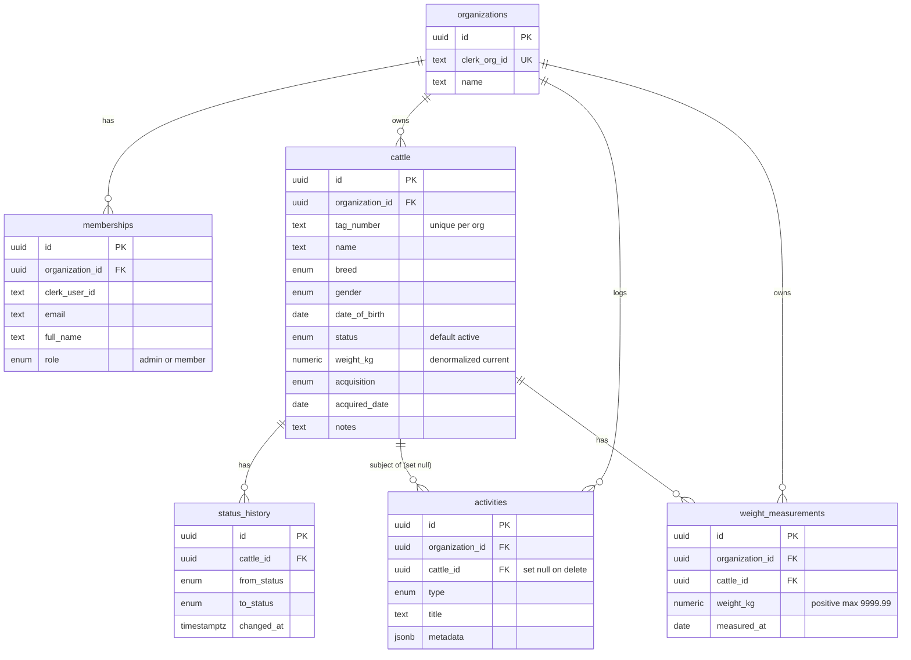

## Entity relationship diagram



## Tables

<AccordionGroup>
  <Accordion title="organizations" icon="building">
    `id` uuid PK · `clerk_org_id` text **unique** · `name` text · `created_at` · `updated_at`.
    Has an `updated_at` trigger.
  </Accordion>
  <Accordion title="memberships" icon="users">
    `id` · `organization_id` FK→organizations (cascade) · `clerk_user_id` · `email` ·
    `full_name?` · `role` (`admin`/`member`, default `member`) · timestamps.
    **Unique** `(clerk_user_id, organization_id)`.
  </Accordion>
  <Accordion title="cattle" icon="cow">
    `id` · `organization_id` FK (cascade) · `created_by_user_id` · `tag_number` ·
    `name?` · `breed` · `gender` · `date_of_birth` · `status` (default `active`) ·
    `weight_kg numeric(6,2)?` (denormalized latest weight) · `acquisition` ·
    `acquired_date?` · `notes?` · timestamps.
    **Unique** `(organization_id, tag_number)`. Indexed on org, status, breed.
  </Accordion>
  <Accordion title="status_history" icon="clock-rotate-left">
    `id` · `cattle_id` FK (cascade) · `changed_by_user_id?` · `from_status?` · `to_status` ·
    `changed_at` · `note?`. Append-only (no `updated_at`).
  </Accordion>
  <Accordion title="weight_measurements" icon="weight-scale">
    `id` · `organization_id` FK (cascade) · `cattle_id` FK (cascade) · `recorded_by_user_id?` ·
    `weight_kg numeric(6,2)` **CHECK > 0 and ≤ 9999.99** · `measured_at date` · `note?` ·
    `created_at`. Indexed on `(cattle_id, measured_at)`. Point-in-time facts (no `updated_at`).
  </Accordion>
  <Accordion title="activities" icon="list-timeline">
    `id` · `organization_id` FK (cascade) · `actor_user_id?` · `cattle_id?` FK **(set null
    on delete)** · `type` · `title` · `description?` · `metadata jsonb` · `created_at`.
    Append-only. Indexed on org, cattle, type, and `(organization_id, created_at DESC)`.
  </Accordion>
</AccordionGroup>

<Note>
  **Cascade vs set-null:** deleting an org cascades to everything it owns. Deleting a cattle
  cascades to its `status_history` and `weight_measurements`, but `activities.cattle_id` is
  set **NULL** so the audit trail survives — the tag is snapshotted into `metadata`.
</Note>

## Migrations

Migrations live in `packages/database/supabase/migrations/` (one timestamped dir):

| File | Adds |
| --- | --- |
| `20260626120000_init.sql` | enums, organizations, memberships, cattle, status_history |
| `20260627120000_activities.sql` | activity_type_enum, activities |
| `20260627211805_weight_measurements.sql` | weight_measurements |

<Steps>
  <Step title="Create a migration">
    ```bash
    cd packages/database && pnpm supabase migration new <snake_case_name>
    ```
    Never edit an existing migration — always append a new file.
  </Step>
  <Step title="Apply locally">
    ```bash
    pnpm --filter @repo/database db:reset
    ```
  </Step>
</Steps>

**Conventions:** `uuid_generate_v4()` from `uuid-ossp` · lowercase enum values · every
org-owned table has `organization_id ... references organizations(id) on delete cascade` +
an index · `created_at`/`updated_at` are `timestamptz default now()` · **no RLS**.

## Types

`packages/database/types.ts` is the typed `Database` definition the Supabase client uses. It
**mirrors the migrations** and is maintained alongside them. App-domain types
(`CattleRow`, `WeightMeasurementWithGain`, …) live in `apps/web/models/<domain>.ts` and are
inferred from Zod schemas.

<Warning>
  When you add a table or column, update **three** places together: the migration, the
  `Database` type in `packages/database/types.ts`, and the Zod schema in
  `apps/web/models/<domain>.ts`.
</Warning>
