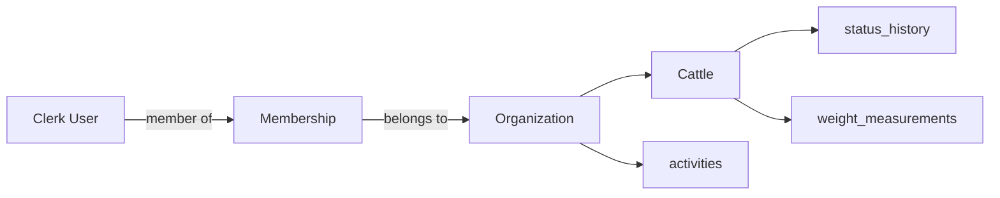
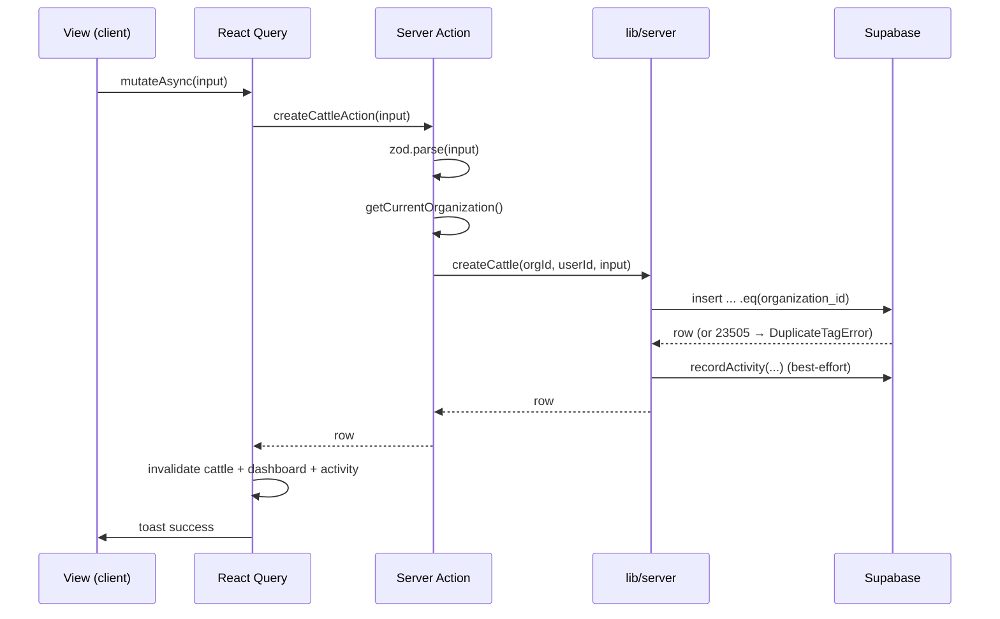

## The ownership hierarchy

Every domain row belongs to an **organization**. A user accesses data through a
**membership** in that organization.



## Org-scoping is enforced in code, not RLS

Server code uses the Supabase **admin client** (service-role key), which **bypasses Row-Level
Security**. There are deliberately **no RLS policies**. Tenant isolation rests on one rule:

<Warning>
  Every function in `lib/server/*.ts` takes `organizationId` as its **first argument**, and
  every query includes `.eq("organization_id", organizationId)`. A missing scope is a
  cross-tenant data leak — the highest-severity review item in this codebase.
</Warning>

```ts lib/server/cattle.ts
export async function getCattleById(organizationId: string, id: string) {
  const db = createAdminClient();
  const { data, error } = await db
    .from("cattle")
    .select("*, status_history(*)")
    .eq("organization_id", organizationId)  // ← tenant isolation
    .eq("id", id)
    .maybeSingle();
  // ...
}
```

Bulk operations scope `.in("id", ids)` **together with** the org filter, so a stale
client-side id list can never reach another tenant's rows.

## Authentication & JIT provisioning

`getCurrentOrganization()` (`lib/server/organization.ts`) runs at the top of every server
action. It returns:

```ts
type CurrentOrgContext = {
  userId: string;              // Clerk user id
  organization: Organization;  // row in `organizations`
  membership: Membership;      // row in `memberships`
};
```

It **just-in-time provisions** the org and membership on first access:

```mermaid
sequenceDiagram
    participant Action as Server Action
    participant Org as getCurrentOrganization()
    participant Clerk
    participant DB as Supabase

    Action->>Org: getCurrentOrganization()
    Org->>Clerk: auth() → { userId, orgId }
    alt no userId
        Org-->>Action: throw OrgUnauthenticatedError
    else no orgId
        Org-->>Action: throw OrgNotSelectedError
    end
    Org->>DB: upsert organization by clerk_org_id
    Note over Org,Clerk: fetch org name from Clerk if creating
    Org->>DB: upsert membership by (org_id, clerk_user_id)
    Note over Org,Clerk: fetch email/full_name if creating; role defaults to 'member'
    Org-->>Action: { userId, organization, membership }
```

<Info>
  Upserts (not inserts) make provisioning **idempotent against Clerk webhook races** — a
  webhook may create the row before the first request reaches its own insert.
</Info>

**Errors:** `OrgUnauthenticatedError` (not signed in), `OrgNotSelectedError` (no org picked),
`OrgProvisioningError` (upsert failed).

## Request lifecycle (a client mutation)



Validation happens in the action before any DB work; Postgres unique violations (`23505`)
become domain errors; and a write invalidates every React Query scope derived from the same
rows (`cattle` + `dashboard` + `activity`).
