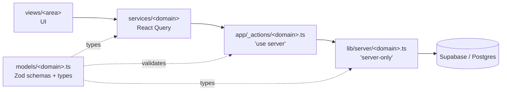

## Monorepo layout

```
apps/
├── web/         ← Next.js product (the only real surface)
├── docs/        ← this Mintlify site
└── storybook/   ← component showcase

packages/
├── ai/                    @repo/ai — OpenAI / Vercel AI SDK
├── auth/                  @repo/auth — Clerk wrapper
├── database/              @repo/database — Supabase clients + migrations + types
├── design-system/         @repo/design-system — shadcn/Radix/Base UI (Tailwind v4)
├── internationalization/  @repo/internationalization — locale routing
├── next-config/           @repo/next-config — shared Next config + env validation
├── rate-limit/            @repo/rate-limit — Upstash Redis
├── security/              @repo/security — Arcjet + Nosecone
├── seo/                   @repo/seo — schema.org structured data
├── storage/               @repo/storage — Vercel Blob
└── typescript-config/     @repo/typescript-config — shared tsconfig
```

Workspaces are declared in `pnpm-workspace.yaml`. Packages are consumed only through their
documented `exports`.

## The layered data flow

Every feature is a vertical slice through five layers. **The entire backend is server
actions — there are no `app/api/*/route.ts` handlers.**



<Steps>
  <Step title="models/<domain>.ts">
    Zod schemas (row, create/update inputs, form schema), inferred types, and form
    transformers. The single source of truth for shapes.
  </Step>
  <Step title="lib/server/<domain>.ts">
    `import "server-only"`. Business logic. Every function takes `organizationId` first and
    scopes every query with `.eq("organization_id", organizationId)`. Uses
    `createAdminClient()`. Throws domain error classes.
  </Step>
  <Step title="app/_actions/<domain>.ts">
    `"use server"`. Thin: parse input with the Zod schema → `getCurrentOrganization()` →
    delegate to `lib/server`. No direct DB access.
  </Step>
  <Step title="services/<domain>/*">
    React Query hooks (`use<Domain>...`, `use<Domain>Mutations`). Own toasts and cache
    invalidation. Keys come from a `keys.ts` factory.
  </Step>
  <Step title="views/<area>/*">
    Page-level UI compositions. Read from stores/services directly.
  </Step>
</Steps>

<Tip>
  Reference slice to copy from: **cattle** — `models/cattle.ts`, `lib/server/cattle.ts`,
  `app/_actions/cattle.ts`, `services/cattle/*`, `views/main/herd/*`.
</Tip>

## A server action, end to end

```ts app/_actions/cattle.ts
export async function createCattleAction(rawInput: CreateCattleInput) {
  const { userId: authedUserId } = await auth();
  if (!authedUserId) throw new OrgUnauthenticatedError();

  const input = createCattleInputSchema.parse(rawInput);          // 1. validate
  const { organization, userId } = await getCurrentOrganization(); // 2. org context
  return createCattle(organization.id, userId, input);             // 3. delegate
}
```

## Frontend building blocks

- **Global modals** live in `components/modals/`. `GlobalModals` is mounted once in the root
  layout and renders each store-driven modal in a React `<Activity>`, so form state persists
  while hidden. Views open them via the modal store
  (`setModal({ animalForm: { open: true, props } })`).
- **Sidebar nav** is data-driven from `constants/navigation.ts` (grouped, each item flagged
  `ready` or `soon`). "Soon" items route to a shared `(main)/[feature]` placeholder page.
- **Feature hooks** (e.g. `useHerdFeatures`) hold a view's action logic and read shared state
  imperatively via store `getState()` instead of prop-drilling.

## State management

<CardGroup cols={2}>
  <Card title="Server state → React Query" icon="server">
    Hooks in `services/<domain>/`. Keys from a `keys.ts` factory. Mutations own toast +
    invalidation. Cattle/weight writes co-invalidate `cattle` + `dashboard` + `activity`.
  </Card>
  <Card title="UI state → Zustand" icon="sliders">
    `stores/shared/modal-store.ts` (modal flags), `stores/herd.ts` (filters, sorts, columns,
    selection). No server-derived data in Zustand.
  </Card>
</CardGroup>
