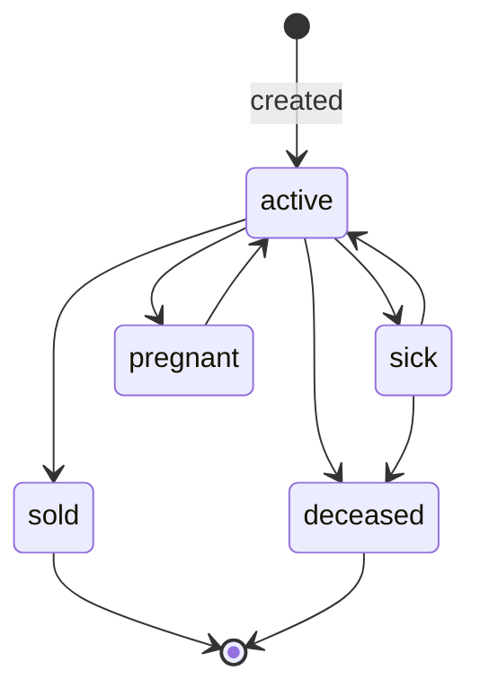

The **cattle** record is the central entity. Each animal belongs to one organization and is
identified by a tag that is unique within that org.

## Statuses

| Status | Meaning |
| --- | --- |
| `active` | In the herd, healthy. The default on creation. |
| `sick` | Needs attention (drives the dashboard "Needs attention" metric). |
| `pregnant` | Expecting (drives the "Pregnant" metric). |
| `sold` | Left the herd by sale. Terminal for active-herd accounting. |
| `deceased` | Died. Terminal for active-herd accounting. |



<Note>
  Transitions are **not currently restricted** in code — any status can be set to any other
  via edit. The diagram shows the *intended* operational flow; enforcement is a future
  enhancement. What is enforced today is the **side effects** of a change.
</Note>

## Side effects of an update

`updateCattle` (`lib/server/cattle.ts`) diffs the patch against the current row:

<Steps>
  <Step title="Status changed">
    Inserts a `status_history` row (`from_status`, `to_status`, `changed_by_user_id`) and
    records a `status_changed` activity with `metadata: { tag, from, to }`.
  </Step>
  <Step title="Other tracked field changed">
    Tracked fields: `tag_number`, `name`, `breed`, `gender`, `date_of_birth`, `weight_kg`,
    `acquisition`, `acquired_date`, `notes`. Records a single `cattle_updated` activity
    listing which fields changed.
  </Step>
  <Step title="No-op save">
    Nothing is logged — the diff is computed first, so saving with no changes is silent.
  </Step>
</Steps>

## Tagging rules

<CardGroup cols={2}>
  <Card title="Unique per organization" icon="fingerprint">
    Enforced by the `cattle (organization_id, tag_number)` unique constraint. A duplicate
    surfaces as `CattleDuplicateTagError` (Postgres `23505` caught explicitly).
  </Card>
  <Card title="Live availability check" icon="circle-check">
    `checkCattleTagAvailableAction` powers the debounced "Available / taken" hint in the
    form. In edit mode the row's own id is passed as `exclude_id` so its existing tag still
    reads as available.
  </Card>
</CardGroup>

### Auto-generated tags

`generateCattleTag` produces a **USDA AIN-style** tag:

```
840-XXX-XXXX-XXXX
```

`840` is the US country prefix; the remaining 12 digits are a **per-organization running
sequence**. The function scans existing `840-`prefixed tags for the current max and
increments. Farmer-typed tags in other formats are ignored by the sequence logic.

## CRUD surface

| Action | Server function | Notes |
| --- | --- | --- |
| List | `listCattle` | Paginated (`limit`/`offset`), filter by status/breed/gender, search, sort. |
| Get one | `getCattleById` | Returns the cattle plus its sorted `status_history`. |
| Create | `createCattle` | Logs `cattle_created`. |
| Update | `updateCattle` | Status + field diff side effects (above). |
| Delete | `deleteCattle` | Logs `cattle_deleted` (tag snapshotted in metadata). |
| Delete many | `deleteManyCattle` | Capped at 200 ids; org-scoped `.in(...)`. |

See the [Server actions reference](/reference/server-actions) for the full list.
