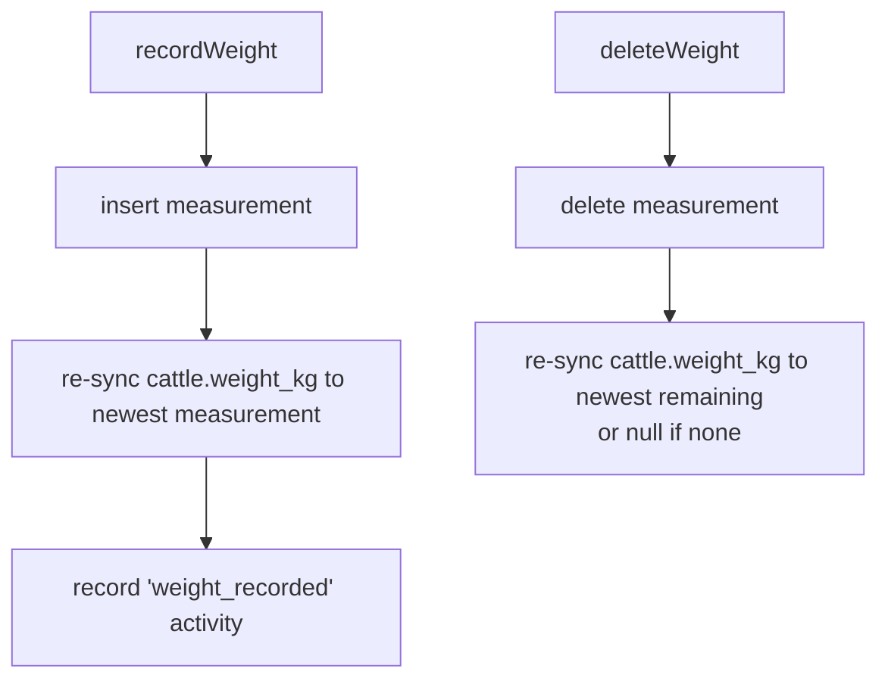

Each animal has a time series of **weight measurements**. The herd-detail page renders this
as a line chart plus a table, and surfaces growth markers.

## Units

<Note>
  Weight is **stored in kilograms** (`weight_measurements.weight_kg` and the denormalized
  `cattle.weight_kg`). The UI **displays pounds** (kg × 2.20462). Conversion is display-only
  (`apps/web/lib/utils/weight.ts`). Valid range: `> 0` and `≤ 9999.99`.
</Note>

## The series and average daily gain

`listWeightHistory(organizationId, cattleId)` returns measurements **oldest-first** with
`average_daily_gain_kg` attached to each row.

ADG between two consecutive measurements:

```
averageDailyGain = (weight − previousWeight) / daysBetween
```

- `null` for the **first** point (nothing to compare against).
- `null` when two measurements share a date (no elapsed days to divide by).

Because ADG is **derived on read**, it stays correct after any insert or delete — there is
nothing to recompute.

## Current-weight cache

`cattle.weight_kg` is a denormalized cache of the **latest** measurement so the herd list and
detail header stay fast without a join.



## Growth markers

The detail chart shows the **current weight** plus the weight nearest to ages **200 / 400 /
600 days** (computed from `date_of_birth`). These help compare an animal's growth against
expected milestones.

## Operations

| Action | Server function | Effect |
| --- | --- | --- |
| List history | `listWeightHistory` | Oldest-first series with ADG per row. |
| Record | `recordWeight` | Verifies the cattle belongs to the org, inserts, re-syncs cache, logs `weight_recorded`. |
| Delete | `deleteWeight` | Deletes, re-syncs the cache from the newest remaining measurement. |

<Info>
  Editing in place is intentionally not supported — a measurement is a point-in-time fact.
  Correct a bad entry by deleting and re-recording.
</Info>
